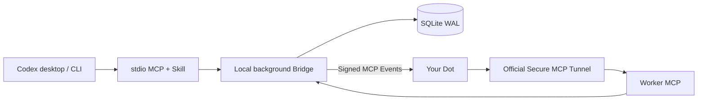

# Codex Dots Bridge

**Give your Dot a task from Codex, and bring the result back.**

Codex Dots Bridge is a task collaboration plugin connecting Codex with your existing Dot. Submit a task in Codex; your Dot uses the plugin to pick it up, ask for missing information, report progress and return a result. Answer, add requirements and follow up in the same Codex conversation.

One task ID connects the collaboration: **Codex delegates → your Dot works → Codex retrieves the result**.

[Download for Windows](https://github.com/shilefumaoqu/codex-dots-bridge/releases/tag/v0.2.0-alpha.4) · [Quick start](docs/快速开始.md) · [中文](README.md)

## What you can do

| Your goal | How the plugin helps |
| --- | --- |
| Delegate a task to your Dot | Submit a goal and text input, and keep a stable task ID |
| Check progress | Read saved progress and queued, running, waiting-for-input or completed states |
| Answer a question | Reply in Codex and continue the original task |
| Add a requirement | Append an update for your Dot to acknowledge at a checkpoint |
| Retrieve and extend a result | Read text or structured output and create a linked follow-up |
| Cancel or recover a task | Request cancellation and verify its acknowledgement; find the original task by ID after reopening Codex |

An **illustrative conversation**:

> You: Ask my Dot to turn these requirements into goals, constraints and open questions.  
> Dot: Is the checklist for the development team or the business team?  
> You: The development team. Sort it by priority.  
> You: Check the progress. When it is done, show me the result and ask for a follow-up checklist.

Use it to delegate supplied text for organization, summaries, comparisons and checklists while staying involved as the task progresses. Your Dot generates the result; the plugin passes tasks, preserves collaboration state and retrieves the output.

## Getting started

Codex chat is the everyday entry point. First install the local components and connect your private plugin and Dot in your own account. Then delegate and check tasks using natural language.

The **Codex Dots Bridge plugin** is your Dot's interface for receiving tasks and returning results. This repository also provides the matching Codex MCP/Skill, local bridge service and installation scripts that connect both ends. Follow the [quick start](docs/快速开始.md) to install, then the [first connection guide](docs/首次连接.md) to link your account.

**Current version: `0.2.0-alpha.4`, a Windows x64 prerelease.** It supports one local user, one existing Dot, and Codex desktop or the official local CLI. Natural subscription renewal and long-term stability remain unverified; see [verified capabilities and limits](docs/兼容性与已知限制.md) for details. This is an independent project.

The Chinese and English READMEs cover the same features, steps and limits. Linked detailed guides are currently in Chinese.

## Before installation

- Windows 10/11 x64, with Windows PowerShell 5.1 or PowerShell 7; install and run in a non-elevated user terminal.
- Codex desktop or the official npm Codex CLI installed; no global Node development environment to maintain.
- Your own Dot, with account/workspace access to Secure MCP Tunnel, private MCP plugins and MCP Events.
- Outbound HTTPS access to the official Tunnel and Events services.

Codex retains its subscription login. This project does not invoke a model API, but the official Tunnel client still needs a **dedicated runtime key** and the corresponding account permissions. A Codex subscription alone does not guarantee those permissions. Complete the initial login, workspace association and key saving through the official interfaces. [Official Tunnel guide](https://developers.openai.com/api/docs/guides/secure-mcp-tunnels)

GitHub distributes source and Windows packages. Each user creates their own private plugin; the official Tunnel alone cannot be used for a public plugin-store submission. This project does not distribute the developer's private plugin identity or credentials.

## Windows package installation

[Repository](https://github.com/shilefumaoqu/codex-dots-bridge) · [v0.2.0-alpha.4 downloads](https://github.com/shilefumaoqu/codex-dots-bridge/releases/tag/v0.2.0-alpha.4) · [Build status](https://github.com/shilefumaoqu/codex-dots-bridge/actions/workflows/ci.yml). Download `codex-dots-bridge-0.2.0-alpha.4-windows-x64-*.zip` and its matching `.sha256`, verify the download source and SHA256, then extract into a fixed directory writable by your user. Do not overwrite a running installation.

Open PowerShell in the extracted directory:

```powershell
.\scripts\check-package.ps1
.\scripts\install.ps1
```

If the current execution policy is Restricted, follow the quick start to use RemoteSigned for this process before verification and installation; do not change the global policy.

If trusted downloaded files are blocked, follow the [quick start](docs/快速开始.md) to unblock this package. No global execution-policy change is needed. Organization policy restrictions should be handled by an administrator.

**Initialize locally first, then configure the connection.** The installer registers this project's MCP and Skill automatically. Without Tunnel parameters, the connection stays `pending`. Follow the [first connection guide](docs/首次连接.md) to save the key safely, configure your private plugin and subscribe your Dot, then rerun the installer. The package includes Node 24.21.0, locked production dependencies and official Tunnel 0.0.16; installation needs no npm dependency download.

Start a new Codex conversation, actually call `dots_status`, and submit a synthetic text task to verify the returned result. A configuration file, a ready Tunnel or event receipt does not mean the task has completed.

## Using it in conversation

> Use $codex-dots-bridge to give the following three sentences to my Dot and summarize them into three conclusions. Process only this text, and return the result text and task ID.

Then try: "Check this task", "Change the budget to five thousand", "Answer its question: choose the second option", "Create a checklist based on the result", or "Cancel this task". If the target task is unclear, list candidates and select one first.

- Nine caller tools cover submission, listing, querying, waiting, updates/answers, linked follow-ups, cancellation, diagnostics and acknowledgement of result retrieval.
- Each wait is limited to 20 seconds, normally five minutes total per Codex turn. Reaching the limit keeps the original task and does not automatically resubmit it.
- Cancelling a running task first records a request; it is shown as cancelled only after the worker acknowledges that it has stopped.
- Tasks, leases and results are stored in SQLite and survive closing Codex. Sleep, shutdown or stopped services prevent receipt of new results.
- Optional desktop revisits are enabled by the user in the original conversation through official automation features; they are off by default. The CLI does not provide scheduled-task management.

## Architecture and data



Codex calls nine caller tools over stdio; your Dot calls eight worker tools through the official Tunnel. A separate local loopback service manages task state and event delivery.

A single-instance FIFO execution slot, stable idempotency keys, input revisions, leases and a transactional outbox protect against silent task loss and incorrect overwrites. Lost leases require reconciliation by default. Only tasks without external side effects that are explicitly authorized for safe retry may run for up to three attempts. Old revisions and late results are retained as evidence. Queueing, claiming, result storage, Codex retrieval and user acceptance are recorded separately.

Runtime data defaults to `%LOCALAPPDATA%\CodexDotsBridge\data`, separate from the installation directory. Caller, worker and Tunnel credentials are separate; only the official child process receives the Tunnel key. Backups contain recovery keys and must be protected as secret files. Uninstalling keeps task data by default. [Security](SECURITY.md)

Stop all related instances before restoring a backup. Restored subscriptions may resume delivery immediately when the service starts. Migration to a different account or Dot is unsupported. Stopping local services does not stop or undo cloud work. See [maintenance and troubleshooting](docs/维护与故障排查.md).

## Building from source

```powershell
.\scripts\bootstrap.ps1
.\scripts\dev.ps1 install
.\scripts\dev.ps1 build
.\scripts\dev.ps1 test
.\scripts\dev.ps1 bridge -- --help
.\scripts\package.ps1 -IncludeTunnel
```

Source builds require access to the official Node distribution, npm registry and official Tunnel release. Bootstrap verifies the private Node runtime without replacing system Node. Tests use isolated data directories and synthetic inputs. Full installation tests require `CODEX_DOTS_TEST_CODEX` set to the official native `codex.exe` path and `CODEX_DOTS_REQUIRE_CODEX_TESTS=1`; CI enforces these tests. Without this configuration, some CLI installation tests are skipped, so the run cannot be described as a complete pass.

Packaging reuses locked dependencies, collects an npm license inventory and the Node and Tunnel LICENSE/NOTICE files, and generates a per-file verification manifest and ZIP SHA256. Building does not upload or create tags. Maintenance commands: `setup`, `run`, `status`, `doctor`, `tasks`, `resolve`, `backup`, `restore`, `uninstall`.

## Validation scope

Existing real-world evidence includes ten text tasks with verifiable results, user answers to clarification questions, updates during execution, linked follow-ups, cooperative cancellation, native desktop and CLI calls, and recovery of original tasks after Bridge/Tunnel interruptions. [Acceptance record](docs/P1-P4验收记录.md)

Automated tests and isolated installation checks do not replace verification of another account's permissions, real Dot subscriptions and result delivery. Natural subscription renewal, long-term operation, login autostart, cloud restore switching, file links and external business actions still require separate validation. When execution status is unknown, reconcile the original task first; this bridge cannot undo external actions or force a Dot to stop.

MIT · [Third-party sources and licenses](THIRD_PARTY_NOTICES.md) · [Contributing](CONTRIBUTING.md) · [Tool contracts](docs/任务与工具契约.md) · [Xingdu icon](docs/图标与品牌.md)
