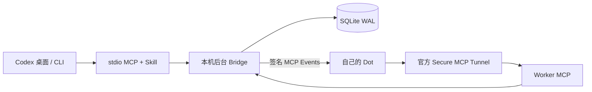

# Codex Dots Bridge

**在 Codex 里，把任务交给你的 Dot，并把结果带回来。**

Codex Dots Bridge 是连接 Codex 与你现有 Dot 的任务协作插件。你在 Codex 中提出任务，Dot 通过插件领取任务、询问缺失信息、报告进度并交付结果；你继续在原来的 Codex 对话里回答、补充和追问。

一次协作沿着同一个任务 ID 进行：**Codex 发起 → Dot 执行 → Codex 取回结果**。

[下载 Windows 包](https://github.com/shilefumaoqu/codex-dots-bridge/releases/tag/v0.2.0-alpha.4) · [快速开始](docs/快速开始.md) · [English](README.en.md)

## 插件能帮你做什么

| 你想做的事 | 插件提供的协作方式 |
| --- | --- |
| 把一份任务交给 Dot | 提交目标和文本资料，取得可继续查询的任务 ID |
| 看看做得怎么样 | 查询排队、执行、等待回答或完成状态，读取已保存的进度 |
| 回答 Dot 的问题 | 在 Codex 中回答澄清问题，沿原任务继续 |
| 中途补充要求 | 给原任务追加要求，由 Dot 在检查点确认采用 |
| 拿回结果并追问 | 读取结果正文或结构化内容，基于结果创建关联追问 |
| 取消或恢复任务 | 请求取消并核对停止回执；重新打开 Codex 后按原 ID 找回任务 |

例如，下面是一段**交互示意**：

> 你：把这份需求交给 Dot，整理成目标、限制和待确认事项。  
> Dot：这份清单主要面向开发团队，还是业务团队？  
> 你：开发团队，按优先级排序。  
> 你：看看进度。完成后把结果给我，再基于它补一份检查清单。

适合把已提供的文本交给 Dot 做整理、总结、对比和清单编写，并在执行过程中持续沟通。结果由你的 Dot 生成；插件负责传递任务、保存协作状态和取回结果。

## 从哪里开始

日常入口就是 Codex 对话。首次使用需要安装本机组件，并在自己的账号中连接私有插件和 Dot；之后可以直接用自然语言派单和查询。

你看到的 **Codex Dots Bridge 插件**是 Dot 领取任务和回传结果的入口。仓库同时提供配套的 Codex MCP/Skill、本机桥接服务和安装脚本，使两端能够完成协作。按照[快速开始](docs/快速开始.md)安装，再按[首次连接](docs/首次连接.md)完成账号关联。

**当前版本：`0.2.0-alpha.4`，Windows x64 预发布。** 支持一个本机用户、一个现有 Dot，以及 Codex 桌面版或官方本机 CLI。自然订阅刷新和长期稳定性仍待验收；[已验证能力与限制](docs/兼容性与已知限制.md)有完整说明。本项目独立开发。

中英文 README 覆盖相同的能力、步骤和限制；链接中的详细指南目前为中文。

## 安装前确认

- Windows 10/11 x64，Windows PowerShell 5.1 或 PowerShell 7；在普通用户终端安装与运行。
- 已安装 Codex 桌面版或官方 npm Codex CLI；无需维护全局 Node 开发环境。
- 有自己的 Dot，并能在自己的账号/工作区使用 Secure MCP Tunnel、私有 MCP 插件和 MCP Events。
- 本机允许连接官方 Tunnel 与 Events 的外部 HTTPS 服务。

Codex 继续使用自己的订阅登录。本项目不调用模型 API，但官方 Tunnel 客户端仍需要**专用运行密钥**与相应账号权限；Codex 订阅本身不保证这些权限可用。首次登录、工作区关联和密钥保存由使用者通过官方入口完成。[官方 Tunnel 指南](https://developers.openai.com/api/docs/guides/secure-mcp-tunnels)

GitHub 发布分发源码和 Windows 安装包。每个使用者创建自己的私有插件；官方 Tunnel 不能单独用于公共插件商店提交。本项目不分发开发者的私有插件身份或凭据。

## Windows 包安装

[GitHub 仓库](https://github.com/shilefumaoqu/codex-dots-bridge) · [v0.2.0-alpha.4 下载页](https://github.com/shilefumaoqu/codex-dots-bridge/releases/tag/v0.2.0-alpha.4) · [构建状态](https://github.com/shilefumaoqu/codex-dots-bridge/actions/workflows/ci.yml)。下载时选择 `codex-dots-bridge-0.2.0-alpha.4-windows-x64-*.zip` 及同名 `.sha256`，核对下载来源与 SHA256，再解压到用户可写的固定目录。不要覆盖正在运行的旧安装目录。

在已解压目录打开 PowerShell：

```powershell
.\scripts\check-package.ps1
.\scripts\install.ps1
```

如果当前执行策略为 Restricted，先按快速开始在本次进程使用 RemoteSigned，再执行校验及安装；不要修改全局策略。

若可信下载文件被阻止，按[快速开始](docs/快速开始.md)解锁本次包；不用修改全局执行策略。组织策略限制应由管理员处理。

**先完成本机初始化，再配置连接。** 安装器自动注册本项目 MCP 与 Skill，尚无 Tunnel 参数时保留连接 `pending`；随后按[首次连接](docs/首次连接.md)安全保存密钥、配置私有插件和 Dot 订阅，再重跑安装入口。包内含 Node 24.21.0、锁定生产依赖与官方 Tunnel 0.0.16，安装阶段不用 npm 下载依赖。

新建 Codex 对话，实际调用 `dots_status`，并提交一条合成文本任务核对结果。配置文件存在、Tunnel ready 或事件收件都不代表任务已完成。

## 对话使用

> 用 $codex-dots-bridge 把下面的三句话交给我的 Dot，整理成三条结论。只处理这段文本，返回正文和任务 ID。

随后可以说：“查这个任务”“预算改成五千”“回答它的问题，选第二种方案”“基于结果补一份清单”“取消这个任务”。任务目标不明确时，列候选再选择。

- 九个 caller 工具：派单、列举、查询、等待、补充/回答、关联追问、取消、诊断和结果取回确认。
- 每次等待最多 20 秒，当前回合通常累计五分钟；到限保留原任务，不自动重派。
- 取消运行任务先记请求，收到执行者停止确认后才显示已取消。
- 任务、租约和结果保存在 SQLite；Codex 关闭后仍保留。电脑休眠、关机或服务停机时不能接收新结果。
- 可选桌面回访由用户在原对话通过官方自动化功能开启，默认不开启；CLI 不提供定时任务管理。

## 架构与数据



Codex 通过 stdio 调用九个 caller 工具；Dot 经官方 Tunnel 调用八个 worker 工具。独立的本机环回服务管理任务状态和事件投递。

单实例 FIFO 执行槽、稳定幂等键、输入修订、租约和事务 outbox 防止静默丢单或错误覆盖。默认失租进入待核对；只有明确允许安全重试的无副作用任务才会最多尝试三次。旧修订与迟到结果保留为证据。入队、领取、结果入库、Codex 取回与用户认可分别记录。

运行数据默认位于 `%LOCALAPPDATA%\CodexDotsBridge\data`，独立于安装目录。caller、worker 与 Tunnel 凭据分开；Tunnel key 只交给官方子进程。备份包含恢复密钥，应按秘密文件保管。卸载默认保留任务数据。[安全说明](SECURITY.md)

恢复备份前须停止所有相关实例；恢复的订阅可能在服务启动后立即继续投递。不支持迁移到不同账号或 Dot。停止本机服务不会停止或撤销云端工作。详见[维护与故障排查](docs/维护与故障排查.md)。

## 源码构建

```powershell
.\scripts\bootstrap.ps1
.\scripts\dev.ps1 install
.\scripts\dev.ps1 build
.\scripts\dev.ps1 test
.\scripts\dev.ps1 bridge -- --help
.\scripts\package.ps1 -IncludeTunnel
```

源码构建需要访问 Node 官方源、npm registry 和官方 Tunnel Release。bootstrap 校验私有 Node，不替换系统 Node。测试使用独立数据目录与合成输入；完整安装测试需设置 `CODEX_DOTS_TEST_CODEX` 为官方原生 `codex.exe` 路径，并设置 `CODEX_DOTS_REQUIRE_CODEX_TESTS=1`，CI 已强制执行。未配置时部分 CLI 安装测试会跳过，不能称为完整通过。

包构建复用锁定依赖，收集 npm 许可清单、Node 和 Tunnel 的 LICENSE/NOTICE，生成逐文件校验 manifest 与 ZIP SHA256。构建不上传、不打 Tag。维护命令：`setup`、`run`、`status`、`doctor`、`tasks`、`resolve`、`backup`、`restore`、`uninstall`。

## 验证范围

已有真实证据包括十条可核对文本任务、用户回答澄清、运行中补充、关联追问、协作取消、桌面与 CLI 原生调用，以及 Bridge/Tunnel 中断后的原任务恢复。[验收记录](docs/P1-P4验收记录.md)

自动化与隔离安装检查不能代替其他账号的授权、真实 Dot 订阅与结果回传。自然订阅刷新、长期运行、登录自启、云端恢复切换、文件链接和外部业务操作仍需单独验证。未知执行状态先核对原任务；本桥接不能撤销外部动作或强制停止 Dot。

MIT · [第三方来源与许可](THIRD_PARTY_NOTICES.md) · [贡献指南](CONTRIBUTING.md) · [工具契约](docs/任务与工具契约.md) · [星渡图标](docs/图标与品牌.md)
